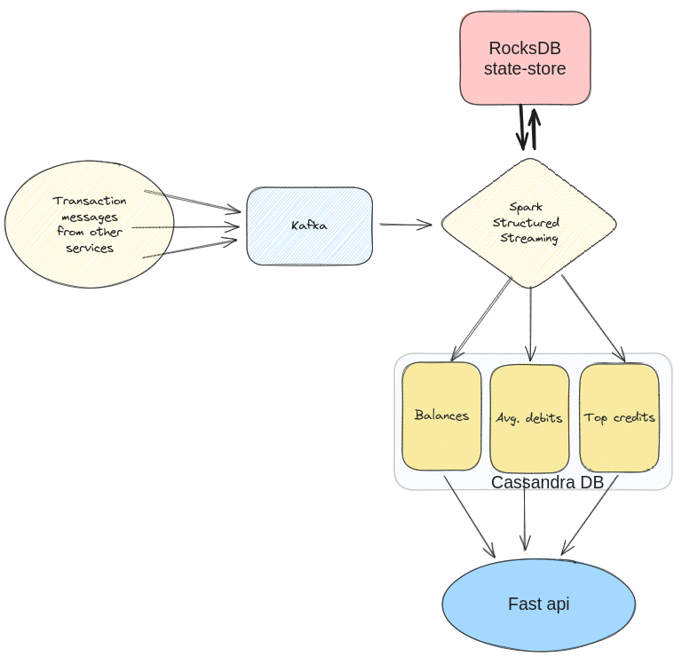

# Logifuture assignment

This project implements a streaming data pipeline using Apache Spark Structured Streaming and Kafka.
The pipeline processes in real time transactions for a betting platform, calculating the balance and average daily debits for each wallet 
as well as top 5 credit transactions for each product. 
The project uses the Cassandra database for storage and ensures fault tolerance through checkpointing.

## Setup and Running the Application

### Prerequisites

    Docker
    Docker Compose

### 1. Build and run the Docker Compose services

Run the docker-compose.yaml with command: `docker compose up --build -d` in order to set up all services.
It will download all necessary docker images, set up the containers and will initialize the
database schema as well as the Kafka topics.

No additional operations are required for set up or initialization.

### 2. Verify the services are running

    Spark Master UI: http://localhost:8080
    Spark Worker UI: http://localhost:8081
    FastAPI: http://localhost:8000

### 3. Sending Kafka Messages
You can send messages to the Kafka topic using the Kafka console producer, either from the host machine or from the container:

When the Kafka container is created, it automatically creates topic: `transactions_topic` which is used to store transaction events
which are then consumed by the Spark service.

#### Send messages from the host machine (use port: 29092):
`kafka-console-producer.sh --topic transactions_topic --bootstrap-server localhost:29092`

#### Send messages from the docker container (use port: 9092):
`docker exec -it <kafka container name OR container id> kafka-console-producer.sh --broker-list kafka:9092 --topic transactions_topic
`
Example: `docker exec -it kafka kafka-console-producer.sh --broker-list kafka:9092 --topic transactions_topic`

#### JSON message:
The Json message needs to have the below structure, otherwise it will be filtered out.

• transactionID (string)
    • walletID (string)
    • productID (string)
    • type (string)
        ◦ credit (add money to wallet)
        ◦ debit (deduct money from wallet)
        ◦ cancelCredit (rollback a credit operation)
        ◦ cancelDebit (rollback a debit operation)
    • amount (BigDecimal)
    • currency (string)
    • timestamp (datetime)

#### Json message example:
{"transaction_id": "trans123","wallet_id": "b1","product_id": "product5678","type": "credit","amount": 5.00,"currency": "USD","timestamp": "2024-05-11T12:50:00Z"}

## REST API Usage
The FastAPI service provides a convenient way to query the processed data in real-time.

### Get Balance for a Wallet
Endpoint: GET /balance/{wallet_id}

Example: `curl -X GET "http://localhost:8000/balance/b1" -H "accept: application/json"`

### Get Average Daily Debit for a Wallet
Endpoint: GET /average_daily_debit/{wallet_id}

Example: `curl -X GET "http://localhost:8000/average_daily_debit/b1" -H "accept: application/json"
`

### Get Top 5 Credits for a Product

Endpoint: GET /top_credits/{product_id}

Example: `curl -X GET "http://localhost:8000/top_credits/product5678" -H "accept: application/json"`

## Database

For this application the Cassandra database was used in order to store all processed and raw data.
Cassandra is a NoSQL db, highly scalable and provides robust support for writing large volumes of data, making it ideal for applications that require high write throughput. It's also distributed, ensuring high availability and resilience.

### Schema

The database schema is initialized automatically from `db_scripts/init_db.cql` which are executed when the cassandra container is created.

The tables are

balances:

    wallet_id text PRIMARY KEY,
    balance float,
    currency text

avg_debits:

    wallet_id text PRIMARY KEY,
    avg_debit float,
    updated_at date

top_credits:

    product_id text PRIMARY KEY,
    top_5_credits text

#### Comment: In a real scenario, there should also be a table to store the transactions, however for the assignment purposes it is not included.

### How to connect

You can connect and query the database using the below commands:
Connect to db: `docker exec -it cassandra cqlsh -u cassandra -p cassandra`

## Architecture

`Apache Kafka`: Used for streaming transaction messages.

`Apache Spark`: Processes the streaming data and maintains state.

`Cassandra`: Stores the wallet balances, avg. daily debits and top 5 scores.

`FastAPI`: Provides a REST API to query the wallet balances, avg debits and top 5 scores per product.

[//]: # (![Alt text]&#40;architecture.png &#41;)

## Limitations & Implementation Comments

1. If the database has already populated tables regarding the balances, debits and top credits, then Spark will not take them into consideration
and will start calculating from the checkpoint or at start time. This is because the states which are used in spark aggregations are populated on
runtime and do not load existing states from the database tables.

2. It is assumed that the currencies are all the same. This is done for simplicity, otherwise we should define a currency conversion table in order to convert the currencies to the standard.

3. In case the same transaction is produced multiple times by the producer, there is no deduplication step to filter them out.

## Troubleshooting

    Checkpoint Directory: Ensure that the checkpoint directory /tmp/spark-checkpoints exists and is writable.
    Cassandra Connection: Verify the Cassandra connection details in the Spark session configuration.
    Kafka Topic: Ensure the Kafka topic transactions_topic is created and accessible.

## Examples

Send the below json messages to Kafka and monitor the balances, avg debits and top credits for wallets with ids `b` and `b2` update.

{"transaction_id": "txfnv02","wallet_id": "b","product_id": "product1","type": "credit","amount": 15.00,"currency": "USD","timestamp": "2024-05-11T12:50:00Z"} 
{"transaction_id": "txfnv03","wallet_id": "b","product_id": "product1","type": "credit","amount": 35.00,"currency": "USD","timestamp": "2024-05-11T12:50:00Z"} 
{"transaction_id": "txfnv04","wallet_id": "b","product_id": "product1","type": "debit","amount": 10.00,"currency": "USD","timestamp": "2024-05-11T12:50:00Z"} 
{"transaction_id": "txfnv05","wallet_id": "b","product_id": "product1","type": "cancelDebit","amount": 5.00,"currency": "USD","timestamp": "2024-05-11T12:50:00Z"} 
{"transaction_id": "txfnv06","wallet_id": "b","product_id": "product1","type": "credit","amount": 25.00,"currency": "USD","timestamp": "2024-02-11T12:50:00Z"} 
{"transaction_id": "txfnv07","wallet_id": "b","product_id": "product1","type": "credit","amount": 5.00,"currency": "USD","timestamp": "2024-05-11T12:50:00Z"} 
{"transaction_id": "txfnv08","wallet_id": "b2","product_id": "product2","type": "credit","amount": 35.00,"currency": "USD","timestamp": "2024-05-11T12:50:00Z"} 
{"transaction_id": "txfnv09","wallet_id": "b2","product_id": "product2","type": "debit","amount": 15.00,"currency": "USD","timestamp": "2024-05-11T12:50:00Z"} 
{"transaction_id": "txfnv12","wallet_id": "b2","product_id": "product2","type": "debit","amount": 5.00,"currency": "USD","timestamp": "2024-05-11T12:50:00Z"} 

## Future Improvements

1. Add Schema Registry: This will allow Kafka brokers filter out corrupted messages before they are consumed by other services.

2. Initialize the state store memory from existing data in the database in Spark script. This approach ensures that the state store is initialized with the latest data from the database, making your Spark job fault-tolerant and accurate.